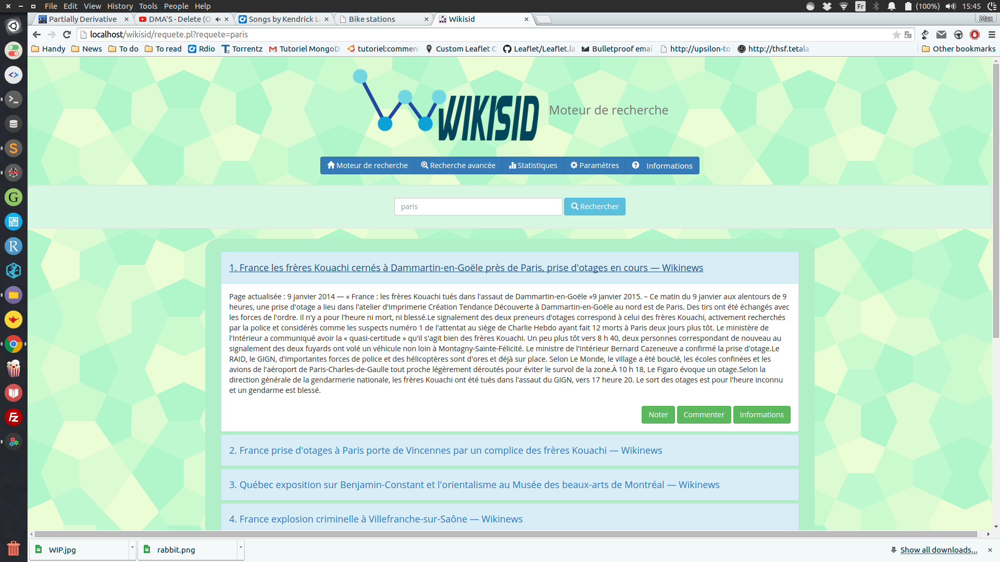

# Wikisid search engine

The objective of this university assignement was to crawl and parse web pages, index them and then build a graphical search engine to query them. Everything is explained in detail in ``Rapport.pdf`` (sorry but it's in French!).

My group and I deviated from the main project and used **MongoDB instead of SQL**, which was really interesting. The end result is a website hosted with a [LAMPP stack](http://www.turnkeylinux.org/lampstack).

More screenshots are available in ``Rapport.pdf``.

To run this yourself you will have to install LAMPP and MongoDB. Then you should put the whole repository in the ``htdocs`` folder of LAMPP. Once you launch LAMPP navigate to ``localhost/Wikisid`` in your browser and tadaa!